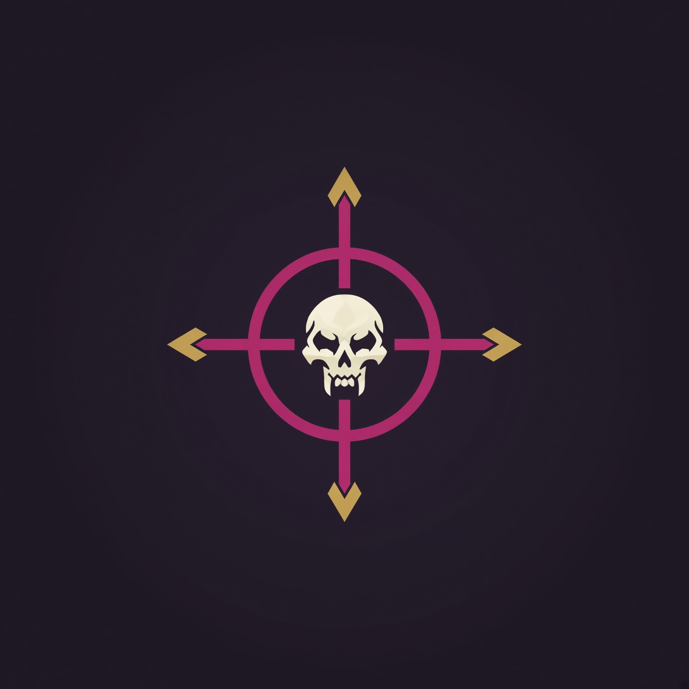

# Psycho Mark's You

**Whole-pack priority and crowd-control marking for World of Warcraft: Forever Beta.**

Psycho Mark's You scans visible enemy nameplates, builds a mark plan from its dungeon/raid database and the group's available crowd control, then lets the player apply the planned marks with an out-of-combat hardware action. It is a Forever-focused fork based on AutoMarkAssist by Swatto.

> **Primary target:** WoW Forever Beta 1.60.1 (Interface 16001) · **Addon version:** `1.1.0-ForeverBeta`

## Features

- Plans marks for multiple visible enemies at once, prioritising dangerous mobs and eligible crowd-control targets.
- In protected clients, prepares a `PMY_AutoPack` macro using `/tm` against visible nameplate unit tokens. Press **TAB**, scroll the mouse wheel, or use a configured **Mark Group** key to apply the plan out of combat. TAB also targets an enemy; the mouse wheel does not change your target.
- Shows a draggable Pack Detected preview with the proposed marks.
- Includes mob priorities, danger levels, CC-immunity flags, and tactical notes for 9 Forever dungeons and 2 raids.
- Detects group classes for common CC assignments and supports editable per-zone custom mob priorities.
- Provides tooltip hints, optional party/raid announcements, a minimap button, and a settings/database/guide window.

## Installation

1. Download or clone this repository.
2. Copy the repository's `PsychoMarksYou` folder into your game's `Interface/AddOns/` directory. The resulting path should include `Interface/AddOns/PsychoMarksYou/PsychoMarksYou.toc` for the standard Forever manifest.
3. Start the game and enable **Psycho Mark's You** in the AddOns list. If the client reports an out-of-date addon, enable **Load out of date AddOns** when appropriate for your client build.

The repository contains alternate TOC manifests as well:

| Manifest | Interface | Intended client |
| --- | ---: | --- |
| `PsychoMarksYou.toc` | 16001 | WoW Forever Beta |
| `PsychoMarksYou_Camelot.toc` | 16001 | Alternate Forever/Camelot client manifest |
| `PsychoMarksYou_Vanilla.toc` | 11508 | Classic Era interface version |

Use the manifest that matches the client, making it the active TOC in the installed addon folder.

## Getting started

Open the settings with `/pmy` (also `/psychomarksyou` or `/psychomark`). On Forever's protected marking path:

1. Make sure enemy nameplates are visible and the pack is in view.
2. Use **TAB**, the mouse wheel, or bind **Mark Whole Group** in the General tab.
3. Review the on-screen preview and adjust the maximum marks per pack or database entries to taste.

TAB and mouse-wheel marking are enabled by default. The default maximum is **3 marks per pack**; it can be changed from 1 to 8 in the General settings. The addon creates or updates a macro named `PMY_AutoPack`; avoid using that name for a personal macro.

### Raid icon roles

| Icon | Default role |
| --- | --- |
| Skull | First kill priority |
| Cross | Second kill priority |
| Square | Hunter Freezing Trap |
| Moon | Mage Polymorph / Paladin Repentance |
| Triangle | Warlock Banish |
| Diamond | Rogue Sap |
| Circle | Druid Hibernate |
| Star | Priest Shackle Undead |

CC marks are assigned only when the group has the relevant class, the mob's creature type is eligible, the mark is enabled, and the mob is not marked CC-immune. The database and settings allow mark roles to be adjusted.

## Commands

| Command | Action |
| --- | --- |
| `/pmy` | Open or close settings |
| `/pmy status` | Show zone, active marks, and detected group CC |
| `/pmy mark` | Scan/mark using the direct API on unprotected clients; on protected clients, refresh the preview and show the secure marking reminder |
| `/pmy clear` | Clear tracked marks; see the protected-client note below |
| `/pmy announce` | Announce the current mark plan |
| `/pmy tab` | Toggle Auto-Mark on TAB |
| `/pmy wheel` | Toggle Auto-Mark on mouse wheel |
| `/pmy hud` | Toggle the Pack Detected preview |
| `/pmy solo` | Toggle marking while not grouped |
| `/pmy on` / `/pmy off` | Enable or disable the addon |
| `/pmy tooltip` | Toggle mob tooltip hints |
| `/pmy debug` | Toggle diagnostic chat output |

## Forever database

The Forever data lives in `PsychoMarksYou/PsychoMarksYou_DB_Forever.lua` and covers:

- The Hall of Thanes
- Ruins of Lordaeron
- Excavation Site: Wetlands
- City of Dalaran
- The Drowned City
- Krol'dok Stronghold
- Alcaz Prison
- Blackmaw Hold
- Shaper's Terrace
- Barrow Deeps
- Hyjal Summit

Each mob entry can specify a preferred raid icon, creature type, danger level (1–3), CC immunity, and a tactical note. The special value `"SKIP"` keeps trivial or swarm adds out of the mark plan.

Use the **Database** tab in `/pmy` to search, add, or adjust mob entries. Custom and learned entries are saved in the `PsychoMarksYouDB` SavedVariables table and take precedence over defaults for their zone. Unknown mobs encountered inside instances can be learned automatically; review or edit those entries in the database tab.

## Settings and behavior

The configuration window has four tabs:

- **General** — enable state, out-of-combat triggers, preview, tooltip hints, keybindings, mark limit, announcements, and other options.
- **Marks & CC** — disable icons and inspect detected group CC capabilities.
- **Database** — browse the zone hierarchy, search entries, and manage custom priorities.
- **Forever Guide** — in-game tips and dungeon notes.

The minimap button opens settings with a left-click, toggles the addon with a right-click, and clears tracked marks with Shift-right-click. You can drag the button to reposition it.

## Compatibility and current limitations

- **Raid groups:** automatic marking is available to the raid leader or an assistant. Party groups do not use that raid-role check. Solo marking is opt-in.
- **Protected clients:** Forever/retail-style clients restrict direct addon calls that change raid targets. Psycho Mark's You uses a secure action/macro initiated by a hardware event instead; automatic TAB and mouse-wheel triggers are armed out of combat.
- **Mark limit:** only the configured number of marks is planned (3 by default). If macro slots are full, the secure-button fallback can mark only the top-priority mob.
- **Clearing icons on protected clients:** the non-secure `/pmy clear`, GUI, minimap, and combat-end paths clear the addon's tracking state but do not directly remove existing raid icons. Bind **Clear All Marks** in the General tab to use the secure reset action to clear the actual icons.
- **Preview HUD:** the Pack Detected banner is draggable and displays the plan; it is not currently a click-to-mark control.
- **Classic Era:** a Classic TOC and a legacy Classic mob table are present, but the active runtime lookup currently uses the Forever database table. Treat Classic database coverage as unverified.
- `Bindings.xml` is included in the repository but is not listed in the TOC manifests. Use the in-addon keybinding controls in the General tab; Blizzard's separate addon-binding entries may not be loaded.

## WoW UI source reference

The Forever client UI source is useful when changing protected actions or checking interface/API behavior:

- [Forever UI source (`Interface`)](https://github.com/Psycho-Core/wow-ui-source/tree/forever/Interface)
- [Secure raid-target action implementation](https://github.com/Psycho-Core/wow-ui-source/blob/forever/Interface/AddOns/Blizzard_FrameXML/SecureTemplates.lua#L582-L604)
- [`/tm` target-marker command](https://github.com/Psycho-Core/wow-ui-source/blob/forever/Interface/AddOns/Blizzard_ChatFrameBase/Shared/SlashCommands.lua#L1451-L1477)

The project currently has no automated test suite; changes to secure actions, nameplate handling, and key overrides should be verified in the target game client.
